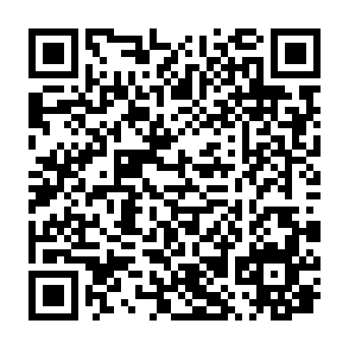

# 🌌 The Digital Graveyard

> **"Humanity begins to turn Dark and Gray like a stone cold society."**

Welcome to the central repository for my soundscapes. This project documents a chronological emotional journey—from total loneliness to the "nightly dreams" that follow betrayal and loss. 

---

## 🔗 Access the Experience
The live, immersive version of this project (with the Black Hole background) can be found here:

### [👉 ENTER THE SOUND](https://uc-labs-llc.github.io/notb/)

---

## 🛠 The Workflow (Ubuntu 25.10)
This production is a fusion of massive analog power and open-source digital precision. 

* **Hardware:** Lenovo ThinkPad X1 Carbon 4th Gen.
* **Drums:** Tracked on my personal **15-piece Pearl Export acoustic kit**.
* **DAW:** **Ardour** (Multi-track recording and final mixing).
* **Processing:** **FFMPEG** via command line for bass levels, depth, and character.
* **Visuals:** **GIMP** for album artwork and UI assets.
* **Metadata:** **Kid3** for ID3 tagging and "DNS-style" data registration.

---

## 🛰 QR Code Gateway
Following my concept of a QR code system being registered like a DNS record, use the code below to bridge the physical and digital worlds. Scanning this will direct any mobile device to the SoundCloud profile for this project.

*Generated via `qrencode` on Ubuntu 25.10.*

---

## 📂 Repository Structure
* `index.html`: The live immersive web page.
* `Black_Hole.png`: The visual background asset.
* `soundcloud_qr.png`: The generated gateway record.
* `README.md`: This technical documentation.

---

## 🛡 Anti-Platform Philosophy
By hosting this project via GitHub Pages and using independent QR generation, I bypass the typical **"cashectomy"** performed by major music platforms—avoiding worthless tests and fees just to keep my own music accessible to my listeners.gg# notb
